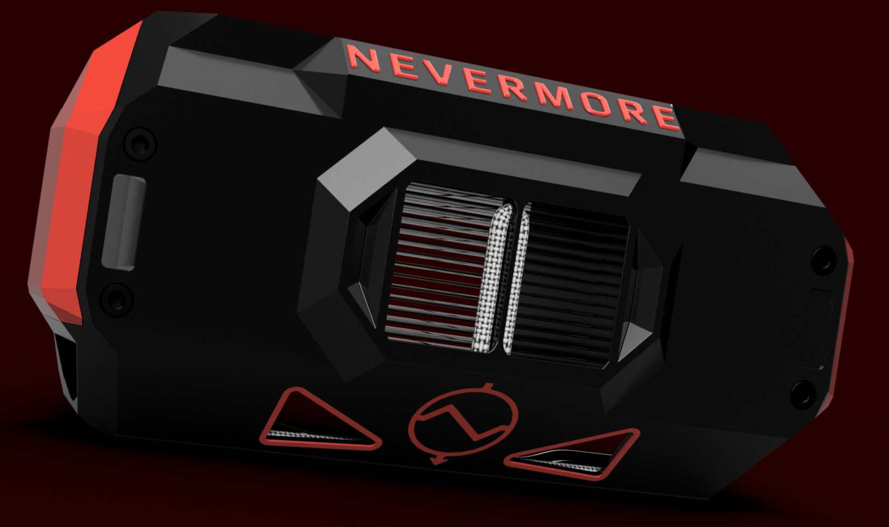

## TEC Carbon Cooler

_In development/testing. Check the carbon cooler beta channel on nevermore discord._ 

Utilizes Peltier elements to cool the filter intake air, enhancing the filtration efficiency and extending the lifespan of your activated carbon filtration media. The filtered, cool air is then passed over the hot side of the Peltier element to dissipate heat, simultaneously reheating the air as a beneficial byproduct, before being recirculated into the chamber to sustain a warm environment where needed. Due to the inefficiency of Peltier cooling, more heat than cooling is generated, resulting in waste heat being released into the chamber and causing a net temperature increase.

In combination with the servo exhaust vent and bedfans, the Peltier Carbon Cooler allows for active chamber temperature control from passive/waste heat sources in combination with chamber exhaust ventilation.

**Designed with safety in mind!**
* Thermistor thermo regulation on both hot and cold sides, ensuring safe cooling and hot-side operation below glass transition temperatures.
* Stealthmax temp/humidity sensors calculates dew points, to avoid risk of condensation inside the machine.
* In case of electrical malfunction (or user override), a built-in drip tray catch any condensation, wicking it to the hot exhaust air stream for evaporation.

_Note on power requirements and additional safety considerations_:   
* The TEC Carbon Cooler will require up to 100 watts of power to run at full capacity, generating up to 50W of carbon cooling and 50W of chamber (waste) heating.
* For most users, this means an additional 24V power supply will be needed, unless software limited power consumtion.
* Note that Peltier elements as a chamber heat source are much safer than resistive/PTC heating, because they operate without the risk of runaway high temperatures or exposed heating elements, and their failure mode typically results in the entire TEC element ceasing to function.
* The two TEC elements in the TEC Cooler are wired in series to ensure the circuit breaks as soon as a TEC element fails (Peltier elements generally last many years).
