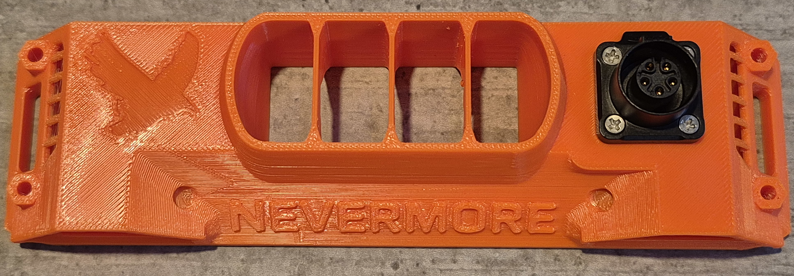
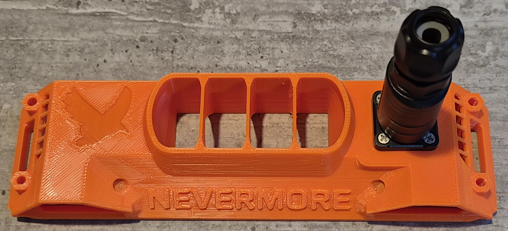
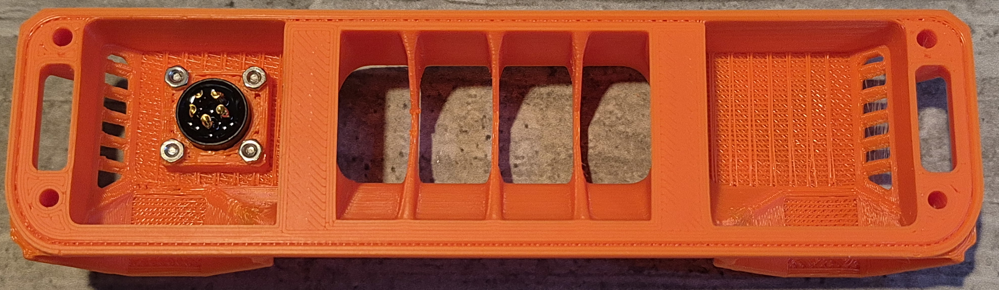

# StealthMax V2 CNLINKO LP-12 Umbilical Mod

This mod enhances the StealthMax V2 with a redesigned intake that integrates a CNLINKO LP-12 umbilical for cable management.

## Features

* **Integrated Umbilical:** The CNLINKO LP-12 connector provides a durable and convenient single-point connection for all toolhead wiring.

---

## Bill of Materials (BOM)

To replicate this mod, you'll need the following:

* **CNLINKO LP-12 Connector:** You are free to use how many pin's you want. In my case I used a LP-12-J04SX-02-401
* **Wiring:** Appropriate gauge wires for your specific components (heaters, thermistors, fans, etc.).
* **Printed Parts:** `umbilical_cnlinko_lp16_intake.stl`
* **Fasteners:**
    Provided with the Connector Socket

---

## Gallery

---

## Support & Contributions

If you have any questions or suggestions, feel free to ask me (@joebar77) in the Nevermore Discord. Contributions and improvements are always welcome!