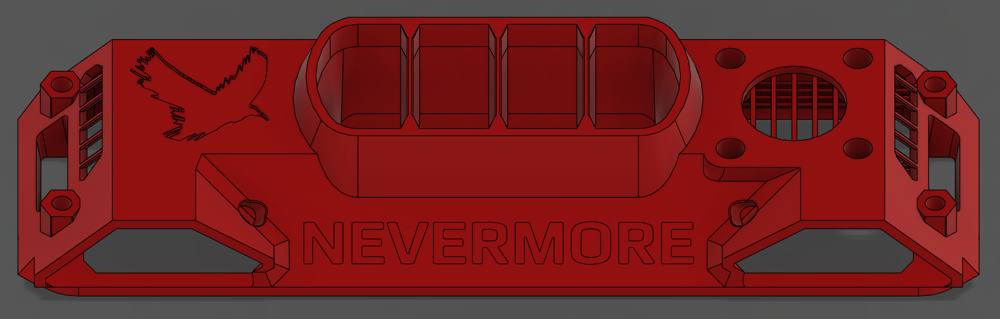

# StealthMax V2 CNLINKO LP-16 Umbilical Mod

This mod enhances the StealthMax V2 with a redesigned intake that integrates a robust CNLINKO LP-16 umbilical for cable management.

## Features

* **Integrated Umbilical:** The CNLINKO LP-16 connector provides a durable and convenient single-point connection for all toolhead wiring.

---

## Bill of Materials (BOM)

To replicate this mod, you'll need the following:

* **CNLINKO LP-16 Connector:** You are free to use how many pin's you want. In my case I used a LP-16-J08SX-02-401
* **Wiring:** Appropriate gauge wires for your specific components (heaters, thermistors, fans, etc.).
* **Printed Parts:** `umbilical_cnlinko_lp16_intake.stl`
* **Fasteners:**
    - 4 FHCS M3 x 8mm
    - 4 Voron Sized Heat Inserts (M3 x 4 x 5)

---

## Gallery

---

## Support & Contributions

If you have any questions or suggestions, feel free to ask me (@kito_was_gone) in the Nevermore Discord. Contributions and improvements are always welcome!