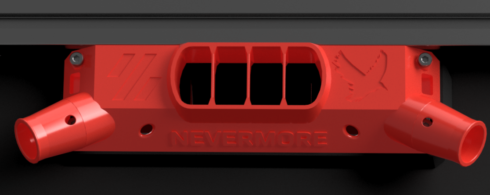

## CPAP Intakes

This Mount fits CPAP tubes, that can be ducted to the gantry to suck dirty fumes closer to where theyre created.

Image shows the standard Chamber Mount, some variations are available (see directories above). Currently, only the Voron-sized back panel mount is available.
