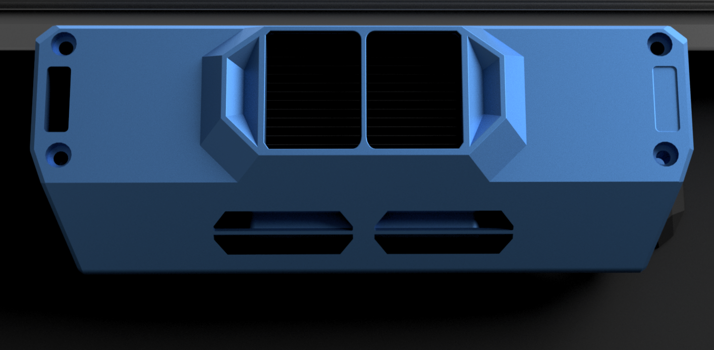

## TEC Carbon Cooler

In development/testing. Check the carbon cooler beta channel on nevermore discord. 

Uses Peltier elements to cool the intake air, which increases the filtration ability and lifetime of your activated carbon filtration media, and then reheats the air upon chamber recirculation. Waste heat gets dumped into the chamber, causing a net temperature increasing effect complementing other non-active heating solutions such as bed fans.

In combination with the servo exhaust vent and bedfans, the Peltier Carbon Cooler allows for active chamber temperature control from passive/waste heat sources.
