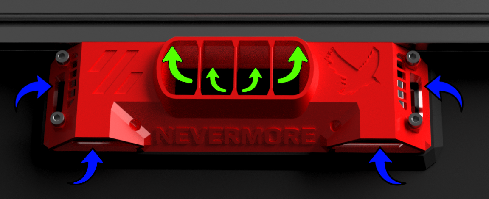

## The mounting piece installs inside your printer, connecting your external StealthMax unit directly to the heated chamber. It draws in contaminated air (indicated by green arrows) and returns clean, filtered air back into the heated chamber (blue arrows). 

Image shows the standard Chamber Mount, some variations are available (see directories above). Currently, only the Voron-sized back panel mount is available.
