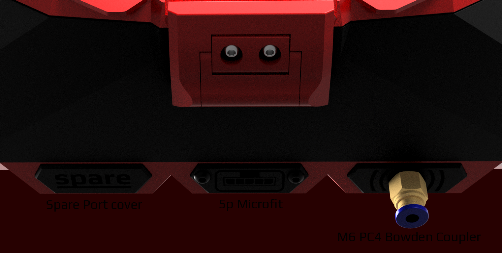
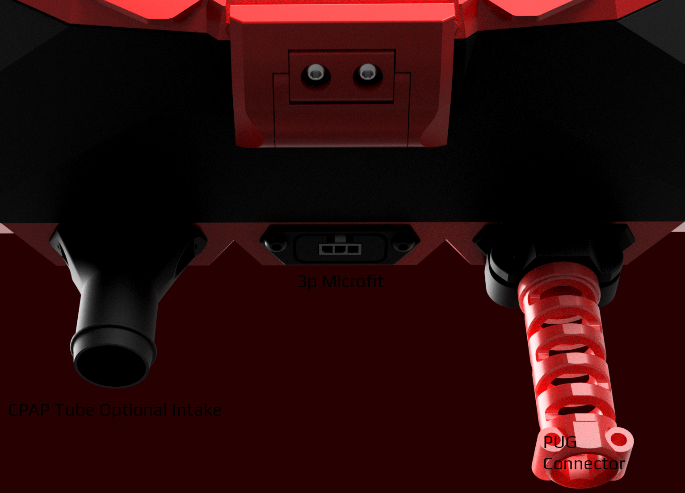

## Bottom Ports
There are three bottom ports on the Stealthmax. The side ones usually has only covers, but can be used for supplemental functions. The center one is usually the main power/data connection.

Left: Spare Cover. Center 5-pin Microfit (for USB connected stealthmax). Right: M6 PC6 Bowden Coupler for users who like to add filament from below. 

Left: CPAP tube intake (duct an intake to anywhere on the machine exteriorly, should be used on both sides for even airflow). Center 3-pin Microfit (for BT connected stealthmax).  Right: PUG Port Cover, for routing umbilicals through the stealthmax. 
