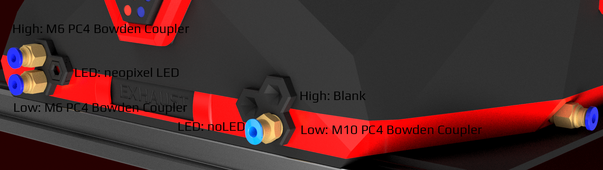

## Bowden_Tube_Intake_Options
There are two main Bowden tube connection points on the Stealthmax (as well as and optional connection points on the side and bottom covers, for a theoretical 8 entry points)

Standard setup with blank port covers on the left, and a single PC4 M6 in the top position on the right.  

  

Ports exist for M10/M6 PC4 bowden couplers, and the optional singe neopixel/SB LED in the center position that can be used for status signalling.
