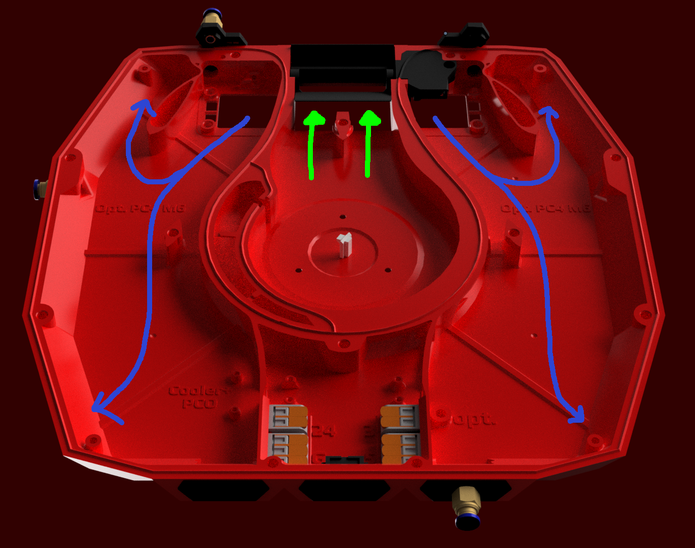

## Flow Chamber
The Flow Chamber forms the bottom component of the StealthMax sandwich. It efficiently **splits and funnels intake air** to the Main Chamber, ensuring even carbon wear. This section also **houses the main fan** that powers the unit, drawing air through the carbon/HEPA container and subsequently exhausting or recirculating it into the enclosure or hot chamber, and **the electronics bay** with pi pico and wago connectors.

