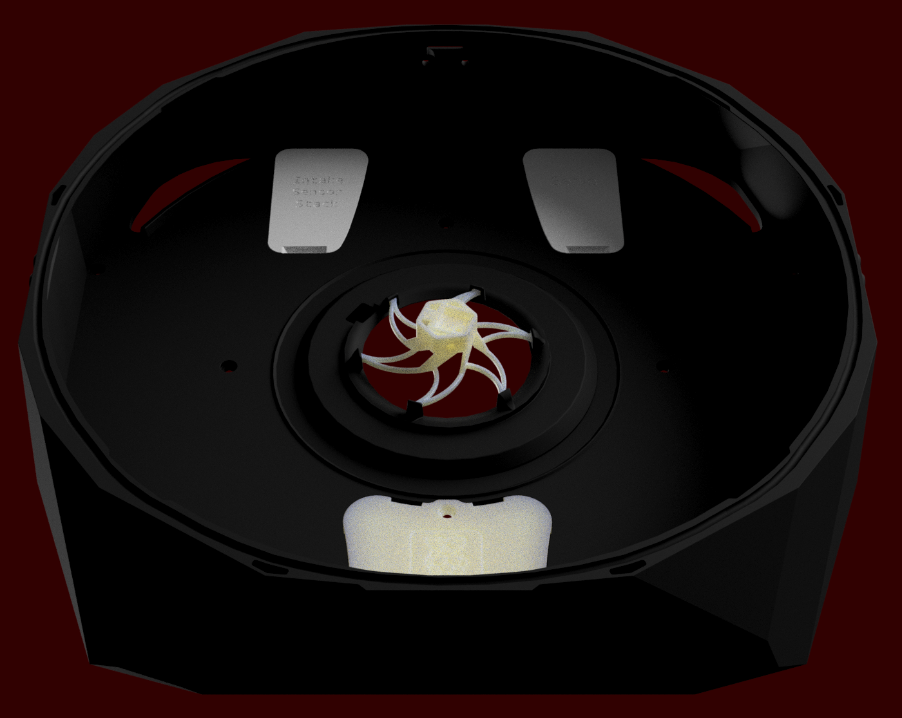

## Main Chamber
The Main Chamber of the Stealthmax contains the removable carbon/H14 HEPA container, houses the slot for the sealing foam cord between main chamber and lid, as well as the access latches and center hexopus air sensor carrier.

