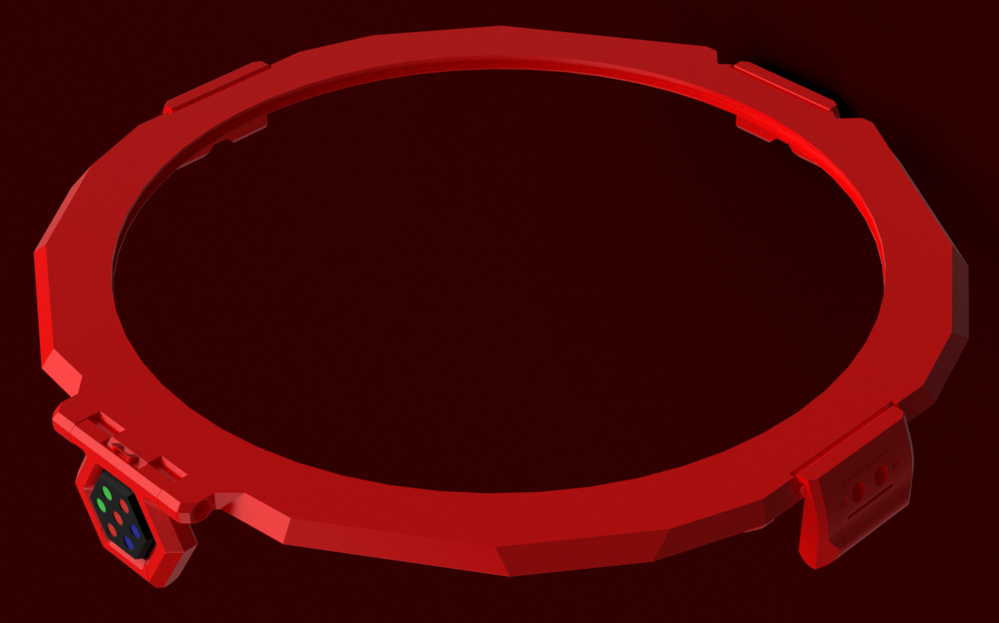

## Lid and latches
The Lid is the top part in the stealthmax sandwich. It holds the 250mm acrylic panel, and is compressed onto the Main chamber by the three latches + main hinge. Underneath the lid piece sits the acrylic panel retainer pice, holding the acrylic panel in place (preferably with the help of some RTV or glue for an optimal seal).

