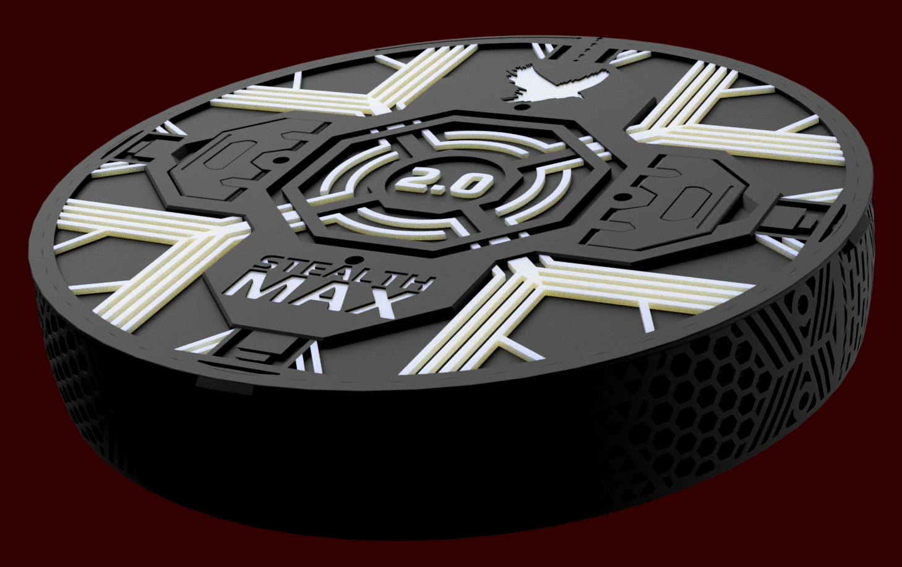

## Carbon and H14 HEPA Container
The carbon container - or "basket" - holds up to a kilogram of carbon - enough to capture bad stuff from your printer for up to six months! Howcome regular hepa+carbon filters has a 6 month rating despite containing a few grams of carbon? Yeah, thats bullshit.  
At any moment, the air in your room will contain tens of grams of different kinds of VOCs - that a few grams of carbon sprinkled on most combined HEPA+Carbon filters can catch VOCs for six months is made up (the HEPA part will last that long, however).

