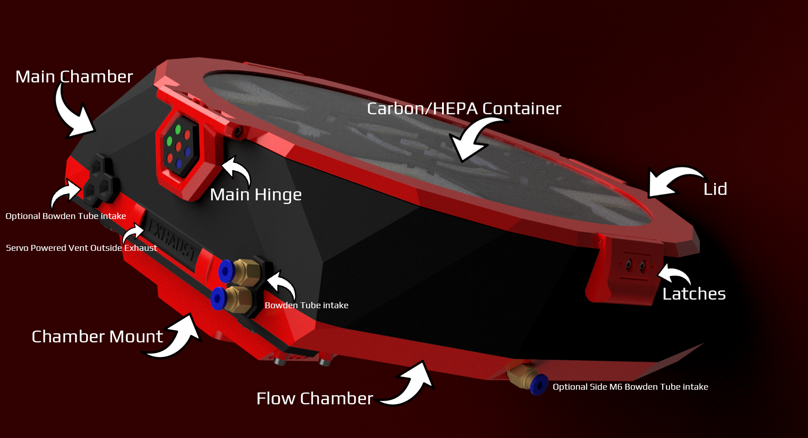

## Printable Files
Welcome to the printable files repo. It contains the needed parts to print your own beta Stealthmax V2 unit! If you dont see a certain piece in the folders, it might be part of the Additional_Pieces STL in this root folder. If you want to change out any of these pieces, you can use the split to parts command in your slicer.

