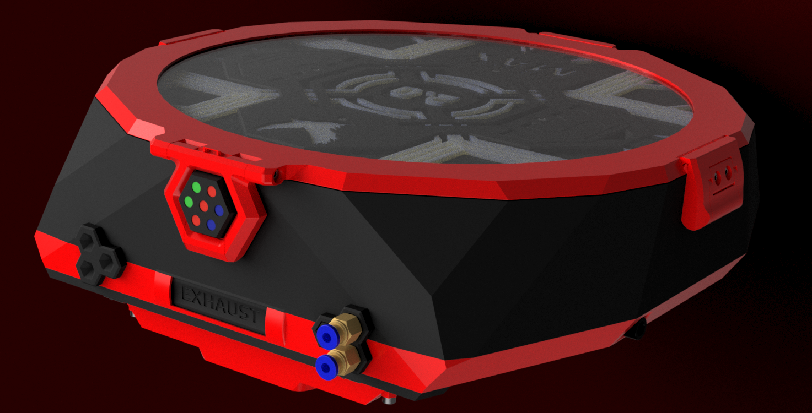
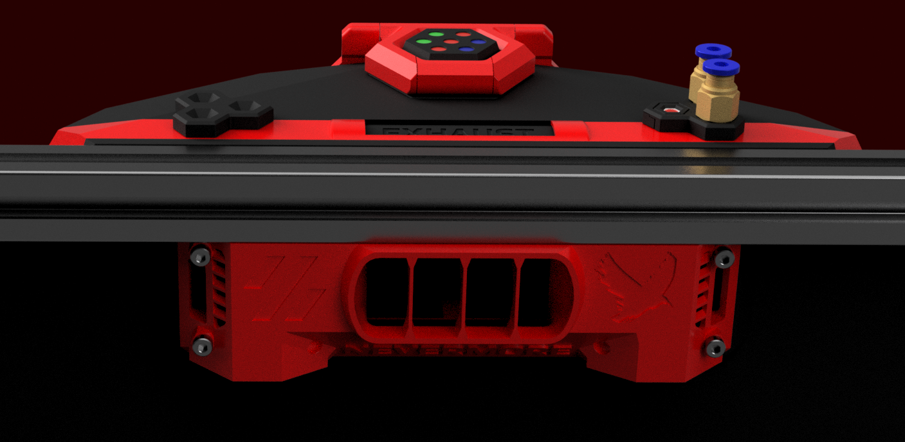

# StealthMax V2 [RC1]– The New Filtration Beast!

## Nevermore StealthMax was already the pinnacle of 3D printing filtration. How could we possibly improve it? Here's how:

---

## 🛡️ **The HEPA Filter**

A significant enhancement in filtration efficiency comes from adopting our new industrial-grade H14 HEPA filter, offering superior performance without compromising airflow. Gone are the days of relying on generic, uncertified robotic vacuum filters!

**Why the upgrade?**  
The Xiaomi robovac filters used in our V1 model lacked an official HEPA rating, typically indicating below-HEPA (≤H10) performance, casting doubt on their effectiveness in capturing ultra-fine particles (UFPs). Since FDM 3D printers primarily emit UFPs and volatile organic compounds (VOCs), using a filter specifically designed and rated to handle these pollutants efficiently is crucial.
  Some might be disappointed this is not an off-the-shelf component. While this is what we usually strive for, there are simply no H14 HEPA filters in a suitable size, and its especially hard (impossible?) finding H14 quality filtration at a price point below $12 - please check on amazon or the likes. At a (6-) 12 month per filter lifetime, Nevermore H14 is less than a dollar per month of use. We try to bring professional filtration to the home user, without charging a premium for it! 

Our new HEPA filter:
- Is **99.995% efficient** at capturing particulates (**H14 standard**).
- Outperforms typical robotic vacuum filters by capturing up to **2000 times more particulates** per filtration pass.
- Specifically excels at capturing ultra-fine particles (UFPs: PM0.01 – PM0.1) emitted during FDM 3D printing—particles that thinner, inferior filters struggle to handle effectively.
- Uses top and bottom sealing foam to force air through the filter and not pass through gaps in the filter unit.

**Nevermore3D proudly offers the highest-grade HEPA filtration available for FDM 3D printing. UFPs: YOU SHALL NOT PASS!**

---
## 🚀 **The Fan**

With the GPU fan from V1 becoming increasingly rare due to evolving GPU cooler designs, we searched far and wide for a powerful, reliable replacement capable of pulling substantial airflow through dense filtration media. **We found it!**

The new **StealthMax V2 7020 fan** (MX7020GBH2) delivers **twice the airflow** at the **same noise level**, meaning:
- Quieter operation at equivalent airflow.
- Efficient filtration of larger chamber volumes.
- Has twice the static pressure.

Moreover, by being slimmer than its predecessor it makes room for even more HEPA surface area, decreasing the pressure drop and maintaining maximum airflow! And since it's not an end-of-life (EOL) design, it should remain available for years to come! Also, contrary to any rumours, its certainly not proprietary!

---

## ⚙️ **The Servo-Controlled Vent**

While StealthMax V1 had an adjustable exhaust vent for controlling chamber temperatures when printing PLA, the solution wasn't optimal. Now, StealthMax V2 upgrades this feature with a **servo-controllable exhaust vent**, enabling:

- Automatic switching between exhaust and recirculation modes, tailored to your specific printing material.
- Chamber temperature management by venting air automatically whenever the chamber exceeds your specified temperature threshold.

---

## 💡 **Intelligent Signaling**

StealthMax V2 adds smart visual signaling (pending future software update), making it easy to monitor your filter status at a glance:

- **Neopixel LEDs** indicating filter function status and carbon replacement intervals.
- LEDs can be installed at the Bowden caps or the main hinge.
- Optional support for a sleek **1.28" LED display** or **KNOMI 2** mounted at the main hinge for the ultimate monitoring and customization experience (currently limited software support).

---

## 🔌 **Expanded Accessibility**

StealthMax V2 dramatically improves user accessibility and versatility:

- **Multiple Bowden tube access points** on every side for clean and easy routing.
- **Up to 6 simultaneous Bowden tubes** supported for complex tool-changer setups. Bowden routing is much improved too, reducing unneccessary filament drag.
- Integrated routing for your **PUG umbilical cable**.
- Convenient additional **CPAP intake ports** at the bottom, allowing flexible air routing throughout your machine.

---

## ❄️ **Carbon Cooler (Optional Add-On) [Kit ready: Summer 2025]**

Let's face it—activated carbon filtration becomes less effective as temperature rises, yet we require high chamber temperatures for optimal printing with most advanced filaments. StealthMax V2 is designed with this challenge in mind, supporting an optional **Carbon Cooler module**:

- **Peltier cooling** chills intake air, increasing carbon adsorption efficiency.
- The hot side of the peltier then **reheats the filtered air**, and is recirculated back into the chamber, maintaining a hot environment where needed.
- Cooler carbon means more effective filtration, capturing VOCs longer, even at chamber temperatures up to 70°C.
- Due to peltier inefficiencies, a bit more waste heat will be generated, so expect a slight bump in chamber temps too - but if your chamber gets too hot we have a servo exhaust for that!

**Cool carbon, hot chamber? Check.**

---

## 🌞 **PCO (Photocatalytic Oxidation) Stage (Optional Add-On) [Kit ready: Fall 2025]**

StealthMax V2 comes ready for integration of an advanced **internal photocatalytic oxidation (PCO)** filtration stage:

- Utilizes **UV light-created hydroxyl radicals** to destroy volatile organic compounds (VOCs) that bypass carbon and HEPA stages.
- Mimics natural sunlight degradation of VOCs in outdoor environments.
- Degraded VOC molecules become easier to capture with subsequent carbon filtration passes, ultimately breaking down into harmless CO₂.

**Sunlight truly is the best disinfectant!**

---

## ✨ **Additional Improvements**

We've implemented numerous improvements to ensure a smoother user experience and better performance:

- Enhanced **print-in-place latch designs** for reliable, hassle-free prints.
- **Carbon container lid** now sits more securely, with additional bolts and improved geometry.
- Reduced material usage in the main chamber, optimized support structures, quicker-to-print carbon basket, better fitting lid and generally more refined.

---

## 🚧 **Installation & Documentation**

[Central3DPrinting Electronics Installation](https://docs.google.com/presentation/d/e/2PACX-1vQseX6O0ZcSdXpOdnfkClK4V5FH0Ed1FzcuMa7BvOZgEiaAOtqwpyQ51u74DkXTCRRQ-EDv1vXZ-xWn/pub?start=false&loop=false&delayms=3000&slide=id.p)
Comprehensive installation guide, BOM (Bill of Materials), and detailed documentation for assembly will be provided shortly.
| Category        | Item                             | Quantity | Notes                                               |
|-----------------|----------------------------------|----------|-----------------------------------------------------|
| **Connectors**  | [Wago 221-413](https://s.click.aliexpress.com/e/_oDV7bC9)                     | 2        |                                                     |
|                 | [Wago 221-412](https://s.click.aliexpress.com/e/_oDV7bC9)                     | 2        |                                                     |
|                 | M6 PC4 Bowden connector          | 1–6      | Typically 1; M10 optional at bottom slot only       |
| **Fasteners**   | M6 x 6mm                         | 2        | Plugs side PC4 M6 Bowden openings                   |
|                 | 2020 extrusion T-nut             | 2        |                                                     |
|                 | M3 inserts (L=4 mm, OD=5 mm)     | 42       |                                                     |
|                 | M2 x 6mm self-tapping screws     | 5        | Pico + servo                                        |
|                 | M3 x 6mm BHCS                    | 35       | Reduce quantity by 1 if not using intake sensor PCB |
|                 | M3 x 8mm SHCS                    | 1        | Omit if not using intake sensor sandwich            |
|                 | M3 x 25mm SHCS                   | 8        |                                                     |
|                 | M3 x 6mm FHCS                    | 4        | Reduce quantity by 1 if not using spacer for 3mm back panels |
|                 | M3 x 10mm BHCS                   | 3        |                                                     |
|                 | M3 x 16mm SHCS                   | 4        |                                                     |
| **Electronics** | Same as StealthMax V1            | -        | Excludes buck converter; replaces DC plug+BT with Microfit 5p for USB; adds Pico pins GP12-15 for Neopixel and FT90M servo |
|                 |[7-bit neopixel hinge display](https://s.click.aliexpress.com/e/_oorL68t)                      | 1        | Optional.                                                    |
|                 |[1,28" hinge display](https://s.click.aliexpress.com/e/_olAkf37)                      | 1        | Optional. Touch version without touch cables easier to install. Non-touch version needs thinner [awg 28 wires](https://s.click.aliexpress.com/e/_oFYgT37) to fit in the slot |
|                 |[FT90M Servo](https://s.click.aliexpress.com/e/_ol1TsBr)                      | 1        | Standard slot will fit FT90M, FT1190M servos. Version for [Emax ES08MA and MDII servos](https://s.click.aliexpress.com/e/_olzGGzx) also available |
| **Fan** | [TopFan MX7020GBH2](https://central3dprinting.com/products/nevermore-stealthmax-v2-fan?ref=NEVERMORE3D)           | 1        | Will also fit the Sanyo C70 |
| **HEPA** | [Nevermore H14 HEPA](https://central3dprinting.com/products/nevermore-stealthmax-v2-h14-hepa-filter?ref=NEVERMORE3D)           | 1        | 116mm OD x 42mm H |
| **Carbon** | [Nevermore](https://central3dprinting.com/products/nevermore-activated-carbon-for-voc-standard-xl-scorch?ref=NEVERMORE3D)           | 1        | Nevermore Carbon, Nevermore Boost, Nevermore Scorch, or any tested quality, non-acid, 4mm activated carbon pellet. 2L will refill with some to spare. |

---

## 📢 **Community & Support**

We're dedicated to continuously improving StealthMax V2. Your feedback, testing, and suggestions are invaluable. Connect with us:

- **GitHub Issues:** Report issues or request enhancements directly here on GitHub.
- **[Discord Community](https://discord.gg/RgQP5cWHxj):** Join fellow makers and contributors for discussions, troubleshooting, and feature discussions.
- **[Check our Print Settings Wiki](https://github.com/nevermore3d/StealthMax/wiki/Print-Settings)** for additional tips and tricks!

---

**Happy printing, breathe easy, and stay stealthy!** 🚀🌬️

